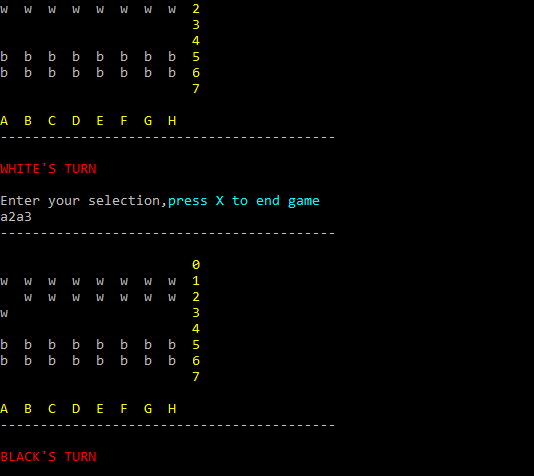
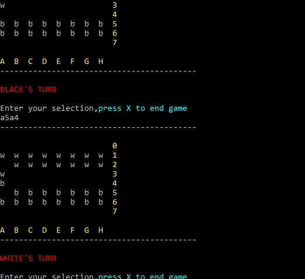

# Checkers-Game
checkers Game running on console screen with C++, using random access file and sequential file operations.

## to run
- You should insert "ConsoleColor.h" in header file. 
## to play
- Firstly use New Game option.
- the player should enter something like this: a2a3 the first 2 character is the source the 2nd 2 characters is destination. You will map the board like the chess board. Horizontal tiles will be named from A to H, vertical tiles from 1 to 8. So  a2a3 means front row leftmost tile of black will forward one tile.

- firstly created a new game

- white's turn and moved a2a3 

- Black's turn and moved b5b4 

- white's turn and moved a3a5, and capture Black's stamp. 
